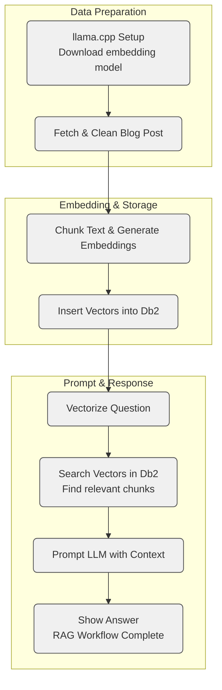

# Build a Local RAG Pipeline with Db2, llama.cpp, and Watsonx.ai


This notebook walks through a minimal but complete Retrieval-Augmented Generation (RAG) pipeline using open tools for local embedding generation and a production-grade database for vector storage and search.

The pipeline combines:

* **Vector embedding generation** using `llama.cpp` and a local GGUF model
* **Vector storage and similarity search** using IBM Db2’s native `VECTOR` support
* **Final answer generation** using a hosted LLM on Watsonx.ai

Each step is implemented in plain Python, with a focus on transparency. The design is modular and can be adapted to other environments or components depending on your setup.

## What You’ll Learn

* How to install and run `llama.cpp` on a CPU-only system
* How to clean and chunk HTML content into sentence-aware segments
* How to generate and batch-insert vector embeddings
* How to perform vector search in Db2
* How to construct context-aware prompts and call a hosted LLM via API

## RAG Pipeline Overview



## Setup Instructions

Run the setup script on a Red Hat Linux (RHEL 9.4) system:

```bash
bash setup.sh
```

The script performs the following:

1. Installs system packages (Python 3.12, libcurl, wget)
2. Installs [`uv`](https://github.com/astral-sh/uv), a Python package manager
3. Creates a virtual environment and installs Python dependencies from `requirements.txt` (including `huggingface-hub`)
4. Installs `llama-cpp-python` from a prebuilt CPU wheel
5. Downloads the `granite-embedding-30m` GGUF model

This project is CPU-only and tested on x86 Red Hat Linux.

## Running the Notebook

Activate the virtual environment:

```bash
source .venv/bin/activate
```

Then launch the notebook:

```bash
jupyter notebook rag-db2-demo.ipynb
```

The notebook walks through:

1. Loading and cleaning an HTML article
2. Chunking text into overlapping segments
3. Generating embeddings using `llama.cpp`
4. Storing vectors in a Db2 table
5. Vectorizing a user query
6. Performing vector search using Db2's vector similarity functions
7. Assembling a prompt from retrieved chunks
8. Sending the prompt to Watsonx.ai and displaying the response

## Environment Configuration

Store credentials in a `.env` file like the following:

```env
# Watsonx credentials
WATSONX_PROJECT=your-watsonx-project-id
WATSONX_APIKEY=your-watsonx-api-key

# Db2 connection
database=SAMPLE
hostname=localhost
port=50000
protocol=tcpip
uid=db2inst1
pwd=your-db2-password
```

The `.env` file should be placed in the project root directory.

## Project Layout

```
.
├── rag-db2-demo.ipynb        # Full RAG workflow notebook
├── setup.sh                  # llama.cpp + model install script
├── requirements.txt          # Required Python packages
├── models/                   # GGUF model goes here
├── .env                      # Environment variables (not committed)
└── README.md
```

## Notes

* Embeddings are generated locally using the open-source `llama.cpp`
* Retrieved context is used to construct prompts for a hosted LLM on Watsonx.ai
* Vector search is performed using Db2’s built-in `VECTOR` functionality
* The LLM is accessed via API and returns grounded responses
* Most components in this pipeline are open and portable; Db2 provides the proprietary vector search engine used in this example

## Adaptability

While this example uses IBM Db2 for vector storage and similarity search, the other components—local embedding generation, HTML preprocessing, chunking, and prompt construction—are based on open tools and can be adapted to work with other vector databases or storage systems.
