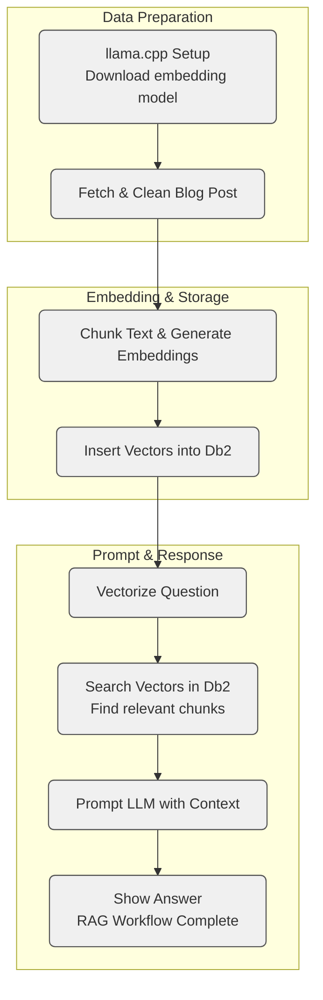

# Build a Local RAG Pipeline with Db2 Vector Search, llama.cpp Embeddings, and Watsonx.ai Answers

This project walks through a full Retrieval-Augmented Generation (RAG) pipeline using open components for local embedding generation and a production-grade database for vector storage and retrieval.

The pipeline combines:

* **Embedding generation** using `llama.cpp` with a local GGUF model
* **Vector search** using IBM Db2’s native `VECTOR` support
* **Answer generation** from a hosted LLM via Watsonx.ai

Most parts of this setup—cleaning source text, chunking, embedding, prompt construction—are implemented in plain Python and designed to be modular. You can adapt this workflow to other vector stores or LLMs by replacing individual components.

---

## What You’ll Learn

* How to run `llama.cpp` for local inference on a CPU-only system
* How to clean and segment raw HTML using sentence-aware chunking
* How to generate and store embeddings
* How to use Db2’s `VECTOR` type and similarity functions for retrieval
* How to send grounded prompts to a hosted LLM and retrieve responses

---

## RAG Pipeline Overview



---

## Setup Instructions

Run the setup script on a Red Hat Linux (RHEL 9.4) system:

```bash
bash setup.sh
```

The script:

1. Installs system packages (`python3.12`, compilers, curl libraries)
2. Installs [`uv`](https://github.com/astral-sh/uv), a fast Python package manager
3. Creates and activates a virtual environment
4. Installs Python dependencies from `requirements.txt`
5. Installs `llama-cpp-python` via prebuilt CPU wheel
6. Downloads the `granite-embedding-30m` GGUF model

---

## Running the Notebook

To launch the demo:

```bash
source .venv/bin/activate
jupyter notebook rag-db2-demo.ipynb
```

You’ll go through:

1. Loading and cleaning an HTML blog post
2. Chunking content using sentence-based overlap
3. Embedding the text using `llama.cpp`
4. Storing and searching vectors inside Db2
5. Constructing prompts from retrieved chunks
6. Sending prompts to Watsonx.ai for final answers

---

## Environment Configuration

Credentials are stored in a `.env` file like below:

```env
# Watsonx credentials
WATSONX_PROJECT=your-watsonx-project-id
WATSONX_APIKEY=your-watsonx-api-key

# Db2 connection
database=SAMPLE
hostname=localhost
port=50000
protocol=tcpip
uid=db2inst1
pwd=your-db2-password
```

Place the `.env` file in the root directory before running the notebook.

---

## Project Layout

```
.
├── rag-db2-demo.ipynb        # Full RAG workflow notebook
├── setup.sh                  # llama.cpp + model install script
├── requirements.txt          # Required Python packages
├── models/                   # GGUF model location
├── .env                      # Environment variables (not committed)
└── README.md
```

---

## Notes

* The **embedding model** runs locally via `llama.cpp` with no GPU required
* The **vector store and search** are handled inside IBM Db2 using `VECTOR` type and distance functions
* The **language model** is hosted on Watsonx.ai and called through an API
* All major steps are modular and replaceable

---

## Adaptability

This setup is meant to be transparent and educational. While Db2 is used here for vector search, the rest of the pipeline—embedding, chunking, prompt assembly—is portable and works with other databases or LLMs.

If you're looking to build a grounded, local-first RAG workflow with fine-grained control over every step, this project can serve as a starting point.